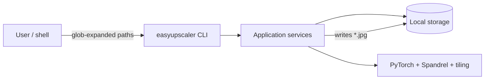
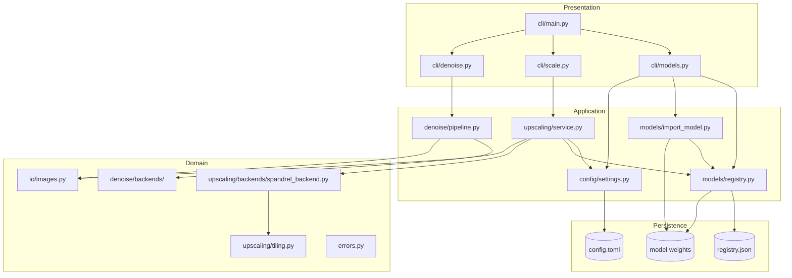
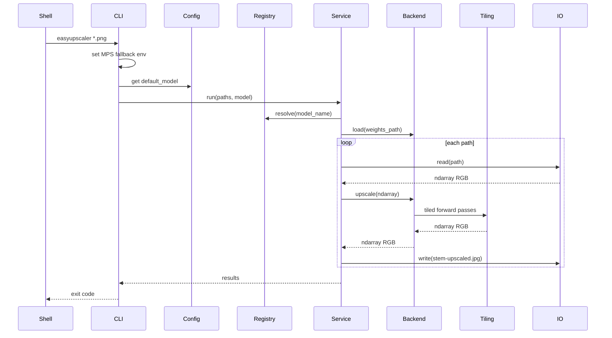
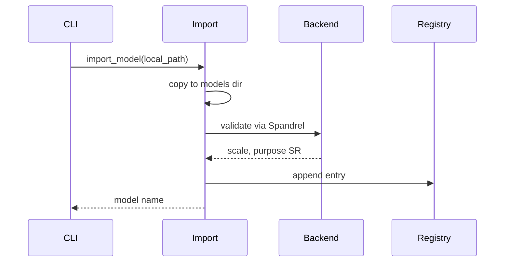

# Architecture

easyupscaler is a Python CLI for upscaling images with imported GAN and ESRGAN-style models. This document describes the MVP system design. Scope and user-facing behavior are defined in [mission.md](./mission.md). Architectural decisions are recorded as [ADRs](./adr.md).

## Goals

- Single entry point: `easyupscaler`
- Simple model lifecycle: import local weights, list, set default, run
- Batch input via shell globbing
- Tiled inference so large photos do not exhaust GPU/unified memory
- Local-only operation: no remote import, cloud inference, or training
- Fast non-inference commands (no PyTorch load for list/default/help)
- Testable layers: CLI, services, backends, I/O

## Non-goals (MVP)

- GUI or web UI
- Model training or fine-tuning
- URL or remote model import
- Cloud upload or remote inference API
- ncnn-vulkan or multi-backend inference
- In-app glob expansion or recursive directory walks
- Parallel batch workers

## System context



The shell expands glob patterns before the process starts. The CLI receives a flat list of file paths.

## Layered design



| Layer | Responsibility | Must not |
|-------|----------------|----------|
| **CLI** | Parse args, set env before torch, invoke services, print progress, exit codes | Import torch at module load (except env bootstrap in `main.py`) |
| **Application** | Orchestrate model management and upscale jobs | Know about Typer or stdout formatting details |
| **Domain** | Tiled upscale, read/write files, raise domain errors | Read CLI flags or config file paths |
| **Persistence** | Files on disk under XDG directories | Contain business rules |

## Components

### CLI (`easyupscaler.cli`)

Built with Typer ([ADR-005](./adr/005-cli-framework-typer.md)). Lazy-imports torch ([ADR-008](./adr/008-lazy-torch-imports.md)).

| Command | Handler | Loads torch? | Service calls |
|---------|---------|--------------|---------------|
| `easyupscaler scale [--model NAME] <paths...>` | `cli/scale.py` | Yes | `UpscaleService.run(paths, model=NAME)` |
| `easyupscaler denoise <mode> [--strength] [--no-text] <paths...>` | `cli/denoise.py` | Yes | `DenoiseService.run(paths, mode, strength)` |
| `easyupscaler models list` | `cli/models.py` | No | `ModelRegistry.list()` |
| `easyupscaler models import PATH` | `cli/models.py` | Yes | `import_model(path)` |
| `easyupscaler models default NAME` | `cli/models.py` | No | `ConfigService.set_default_model(NAME)` |

The bare invocation `easyupscaler <paths...>` is no longer supported. Users must use `easyupscaler scale` or `easyupscaler denoise`. See [specification-denoise.md](./specification-denoise.md) for denoise behavior.

`cli/main.py` sets `PYTORCH_ENABLE_MPS_FALLBACK=1` before any torch import ([ADR-002](./adr/002-inference-device-policy.md)).

Exit codes:

- `0` — all operations succeeded
- `1` — one or more failures (missing model, bad input, import error, partial batch failure)

See [ADR-006](./adr/006-batch-processing-and-exit-codes.md).

### ConfigService (`easyupscaler.config`)

Loads and saves user preferences. No torch dependency.

- File: `$XDG_CONFIG_HOME/easyupscaler/config.toml`
- MVP keys: `default_model` (string, optional)
- Missing config file is valid; upscale fails with a clear message when no default is set and `--model` is omitted

### ModelRegistry (`easyupscaler.models`)

Tracks installed models in `$XDG_DATA_HOME/easyupscaler/registry.json`. JSON read/write only; no torch.

Each entry:

```json
{
  "name": "4xUltrasharp",
  "filename": "4xUltrasharp.pth",
  "path": "/Users/me/.local/share/easyupscaler/models/4xUltrasharp.pth",
  "scale": 4,
  "imported_at": "2025-06-15T12:00:00Z"
}
```

Rules ([ADR-004](./adr/004-model-registry-and-import.md)):

- Name derived from filename stem at import
- Scale read from Spandrel at import; reject unsupported or non-SR models
- Duplicate name on import: reject with error

Weights live in `$XDG_DATA_HOME/easyupscaler/models/`.

### Import pipeline (`easyupscaler.models.import_model`)

Local file only ([ADR-004](./adr/004-model-registry-and-import.md)).

1. Verify `PATH` exists and is readable
2. Copy into the models directory (preserve filename)
3. Load via Spandrel; require `purpose` in `SR` or `Restoration`; reject on `UnsupportedModelError`
4. Read `scale` from Spandrel metadata; reject when scale &lt; 1
5. Append registry entry

Warn on stderr when importing `.pth` (pickle-based) checkpoints from untrusted sources. Prefer `.safetensors` when the user has that format.

### UpscaleService (`easyupscaler.upscaling.service`)

Orchestrates a multi-file job ([ADR-006](./adr/006-batch-processing-and-exit-codes.md)).

1. Resolve model name from `--model` or config default
2. Load registry entry; fail fast if unknown
3. Lazily construct one `SpandrelBackend` for the job (reuse across batch)
4. For each input path sequentially:
   - Read image via `ImageIO`
   - Call `backend.upscale(image)` (tiled internally — [ADR-007](./adr/007-tiled-inference.md))
   - Write `{stem}-upscaled.jpg` beside input, or under optional `--output DIR` ([ADR-003](./adr/003-image-output-conventions.md), [ADR-016](./adr/016-optional-output-directory.md))
   - Record success or failure; continue on failure
   - On MPS: optionally `torch.mps.empty_cache()` after large images
5. Print summary; return overall success boolean

Empty path list: fail before loading the model.

### SpandrelBackend (`easyupscaler.upscaling.backends`)

Single backend for MVP ([ADR-001](./adr/001-spandrel-pytorch-backend.md)).

- `ModelLoader(device=...).load_from_file(path)` → `ImageModelDescriptor`
- Device: MPS if available, else CPU ([ADR-002](./adr/002-inference-device-policy.md))
- On MPS op failure: retry whole image on CPU
- Delegates forward pass to tiled runner ([ADR-007](./adr/007-tiled-inference.md))
- Accepts and returns `numpy.ndarray` RGB float `[0, 1]` at the service boundary

Spandrel does **not** convert PIL/NumPy to tensors or implement tiling — that is easyupscaler code, following patterns from ComfyUI and A1111.

### Tiling (`easyupscaler.upscaling.tiling`)

| Constant | Default |
|----------|---------|
| `DEFAULT_TILE_SIZE` | 512 |
| `DEFAULT_TILE_OVERLAP` | 32 |
| `MIN_TILE_SIZE` | 128 |

- Split oversized images into overlapping tiles; weighted merge in overlap regions
- On OOM: halve tile size until `MIN_TILE_SIZE` or fail
- Respect `model.tiling` (`SUPPORTED`, `DISCOURAGED`, `INTERNAL`)

### ImageIO (`easyupscaler.io`)

- Input: PNG and JPEG via Pillow → RGB `numpy` float `[0, 1]`
- Output: always JPEG, `quality=95`, `subsampling=0` ([ADR-003](./adr/003-image-output-conventions.md))
- RGBA PNG: convert to RGB before save
- Naming: `{input_stem}-upscaled.jpg` beside input (default) or under optional `output_dir` ([ADR-016](./adr/016-optional-output-directory.md)); on conflict, `{input_stem}-upscaled-NNNN.jpg` ([ADR-003](./adr/003-image-output-conventions.md), [ADR-011](./adr/011-output-conflict-indexing.md))
- `write()`, `write_png()`, `write_denoised()`, `write_txt()`, and `write_md()` accept optional `output_dir: Path | None`
- When `output_dir` is set, ensures the directory exists before resolving indexed filenames
- Indexed suffix when base output exists; never overwrite without prompt

## Data flow

### Upscale



### Model import



## Storage layout

Uses XDG Base Directory defaults ([ADR-004](./adr/004-model-registry-and-import.md)).

```
~/.config/easyupscaler/
  config.toml                 # default_model = "4xUltrasharp"

~/.local/share/easyupscaler/
  registry.json               # installed model metadata
  models/
    4xUltrasharp.pth
    remacri.pth
```

On macOS, `XDG_CONFIG_HOME` and `XDG_DATA_HOME` fall back to `~/.config` and `~/.local/share` when unset.

## Package layout

```
easyupscaler/
  __init__.py
  cli/
    main.py                   # Typer app, env vars, entry point
    models.py
    scale.py                  # scale subcommand (formerly bare upscale)
    denoise.py                # denoise subcommand
    job_progress.py           # phase-aware TTY/plain job display (Mockup A)
  progress.py                 # PhaseEvent types shared by services and CLI
  config/
    paths.py                  # XDG directory helpers
    settings.py               # ConfigService (no torch)
  models/
    registry.py               # ModelRegistry (no torch)
    import_model.py           # local file import (lazy torch)
  denoise/
    catalog.py                # managed model catalog and selection matrix
    document_constants.py     # Sauvola, morph, anti-alias, flat-snap constants
    document_enhance.py       # enhance_document_contrast: binarize + post-process
    document_ocr.py           # Tesseract OCR on grayscale array
    document_ocrai.py         # VLM OCR orchestration (resize, prompt)
    ocrai_catalog.py          # VLM filenames, URLs, constants
    ocrai_downloader.py       # two-file GGUF download with repo fallback
    ocrai_prompt.py           # load_ocrai_prompt(): read prompts/ocrai.yaml
    prompts/
      ocrai.yaml              # VLM Markdown extraction prompt
    ocrai_service.py          # OcraiService: load model once per batch; extract_markdown()
    downloader.py             # auto-download denoise weights
    pipeline.py               # DenoiseService (document branch + OCR in _process_path)
    backends/
      base.py                 # DenoiseBackend protocol
      spandrel_common.py      # shared Spandrel load/device/tiling
      scunet_backend.py
      fbcnn_backend.py
      dejpg_backend.py
      archiver_backend.py
      book_compact_backend.py # catalog/backend only; not used by document mode
  upscaling/
    service.py                # UpscaleService
    tiling.py                 # tiled inference
    backends/
      base.py                 # UpscalerBackend protocol
      spandrel_backend.py
  io/
    images.py                 # ImageIO
    heic.py                   # pillow-heif registration
  errors.py                   # domain exceptions
tests/
  ...
pyproject.toml
Makefile                      # build, install, test, lint, typecheck
uv.lock                       # locked dev + runtime deps (uv)
```

## Development toolchain

See [ADR-009](./adr/009-development-toolchain.md).

| Tool | Role |
|------|------|
| **uv** | Dev env sync, lockfile, `uv build`, `uv pip install` |
| **ruff** | Lint (and optional format check) |
| **mypy** | Static type checking on `easyupscaler` |
| **pytest** | Unit and integration tests |
| **Make** | Canonical entry points for developers |

**Minimum Python:** 3.13+

### Makefile targets

| Target | Command chain |
|--------|----------------|
| `make sync` | `uv sync` |
| `make lint` | `ruff check` (+ format check if configured) |
| `make typecheck` | `mypy easyupscaler` |
| `make test` | lint → typecheck → pytest (all must pass) |
| `make build` | `uv build` |
| `make install` | `uv pip install .` into active Python |

Activate the desired Python (system or venv) before `make install` to control which interpreter receives the `easyupscaler` console script.

## Dependencies

| Package | Role |
|---------|------|
| `typer` | CLI framework |
| `pillow` | Image read; JPEG write |
| `tomlkit` | Read/write config (preserve formatting) |
| `torch` | Inference runtime (lazy import) |
| `spandrel` | Load and run upscaler weights (lazy import) |
| `numpy` | Array interchange between I/O and backend |
| `llama-cpp-python` | VLM OCR via `--ocrai` (lazy import; vision handler required) |
| `pytesseract` | Default document OCR via Tesseract |

Versions are pinned in `pyproject.toml`. No HTTP client in MVP.

`spandrel-extra-arches` is a runtime dependency (always installed; see product decisions).

Dev dependency group (via uv): `pytest`, `ruff`, `mypy`, plus stubs as needed.

## Error handling

| Situation | Layer | Behavior |
|-----------|-------|----------|
| No `--model` and no default set | UpscaleService | Error message; suggest `models default` |
| Unknown model name | ModelRegistry | Error; list installed names |
| Invalid input path | ImageIO | Per-file failure in batch |
| Unsupported input format | ImageIO | Per-file failure |
| Empty path list | CLI / Service | Fail before inference |
| Import: file not found | Import | Fail; do not register |
| Import: unsupported architecture | Import | Fail with `UnsupportedModelError` message |
| Import: unsupported purpose | Import | Fail; purpose must be SR or Restoration |
| Import: duplicate name | Registry | Fail |
| MPS unavailable at startup | SpandrelBackend | CPU with warning ([ADR-002](./adr/002-inference-device-policy.md)) |
| MPS op failure mid-inference | SpandrelBackend | Retry image on CPU |
| OOM during tile | Tiling | Halve tile; retry until min or fail |
| Partial batch failure | UpscaleService | Continue; exit `1` ([ADR-006](./adr/006-batch-processing-and-exit-codes.md)) |

Domain exceptions in `errors.py` map to user-facing CLI messages at the presentation layer. Programming errors propagate uncaught.

## Testing strategy

Quality gate: **`make test`** runs ruff, mypy, then pytest with a **≥80% line coverage** gate on `easyupscaler` ([ADR-009](./adr/009-development-toolchain.md), [ADR-010](./adr/010-code-coverage-gate.md)). All must pass.

| Level | Target | Notes |
|-------|--------|-------|
| Lint | `ruff check` | Part of `make test` |
| Types | `mypy easyupscaler` | Part of `make test`; scoped ignores for untyped third-party only |
| Coverage | `pytest-cov` on `easyupscaler` | Part of `make test`; fail under 80% line coverage (fast suite) |
| Unit | `registry`, `settings`, output naming, tiling merge | No GPU |
| Unit | `UpscaleService` with fake backend | Inject protocol mock |
| Integration | CLI via `typer.testing.CliRunner` | Mock backend; verify list/default skip torch |
| Slow | End-to-end with tiny `.pth` fixture | `@pytest.mark.slow`; optional in CI; local MPS |

Linux CI uses mocked backend. MPS tests are manual or optional slow markers.

## Related decisions

| ADR | Topic |
|-----|-------|
| [001](./adr/001-spandrel-pytorch-backend.md) | Spandrel + PyTorch; inference pipeline owned by app |
| [002](./adr/002-inference-device-policy.md) | MPS, op fallback, CPU retry |
| [003](./adr/003-image-output-conventions.md) | JPEG output, quality, naming |
| [004](./adr/004-model-registry-and-import.md) | Registry, XDG storage, local import |
| [005](./adr/005-cli-framework-typer.md) | Typer CLI framework |
| [006](./adr/006-batch-processing-and-exit-codes.md) | Sequential batch and exit codes |
| [007](./adr/007-tiled-inference.md) | Tiled inference for large images |
| [008](./adr/008-lazy-torch-imports.md) | Lazy torch/spandrel imports |
| [009](./adr/009-development-toolchain.md) | uv, ruff, mypy, Makefile |
| [010](./adr/010-code-coverage-gate.md) | ≥80% coverage gate in make test |
| [011](./adr/011-output-conflict-indexing.md) | Indexed output filenames on conflict |
| [012](./adr/012-denoise-model-auto-download.md) | Auto-download of managed denoise weights |
| [013](./adr/013-denoise-png-output.md) | PNG output for denoise command |
| [014](./adr/014-heic-two-pass-denoise.md) | Two-pass HEIC photo denoise |
| [015](./adr/015-heic-pillow-heif.md) | Required pillow-heif for HEIC |
| [016](./adr/016-optional-output-directory.md) | Optional `--output` / `-o` directory |
| [017](./adr/017-scikit-image-dependency.md) | scikit-image hard dep for document mode Sauvola |
| [018](./adr/018-document-two-pass-pipeline.md) | Two-pass AI pipeline for document denoise | Superseded by 019 |
| [019](./adr/019-document-binarize-antialias.md) | Document mode: Archiver + Sauvola binarize + anti-alias |
| [020](./adr/020-document-postprocessing-refinements.md) | Document post-processing: morph, edge-only AA, flat snap |
| [021](./adr/021-document-ocr-tesseract.md) | Default Tesseract OCR for document denoise |
| [022](./adr/022-opt-in-vlm-ocr-ocrai.md) | Opt-in VLM OCR via `--ocrai` (Qwen2.5-VL + llama.cpp) |
| [023](./adr/023-ocrai-markdown-additive.md) | `--ocrai` additive Markdown; Tesseract unchanged for `.txt` |
